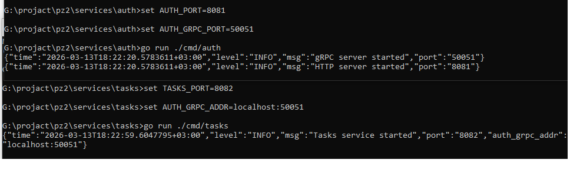
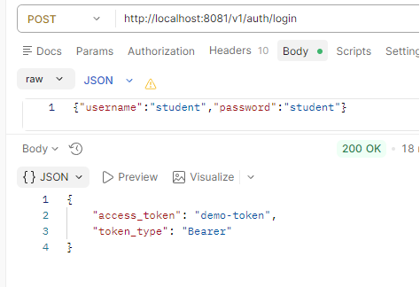
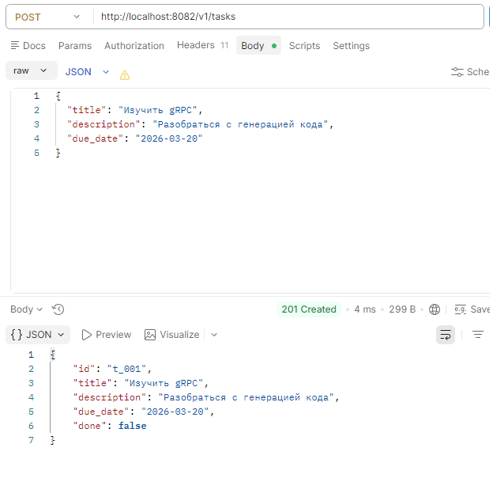
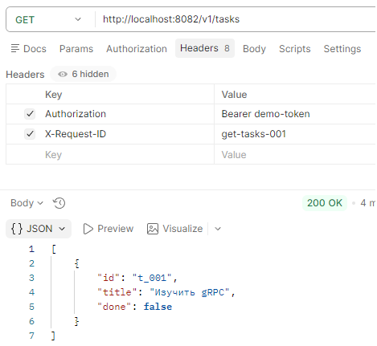
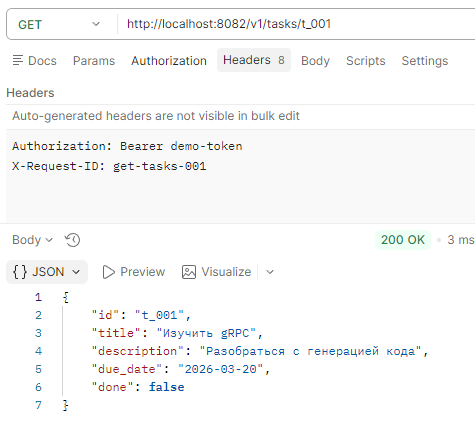
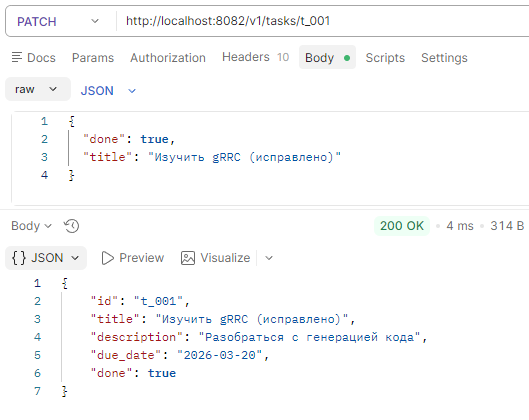
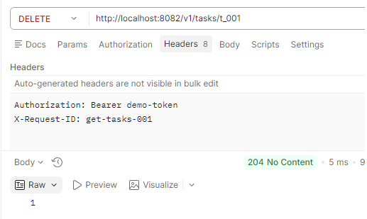
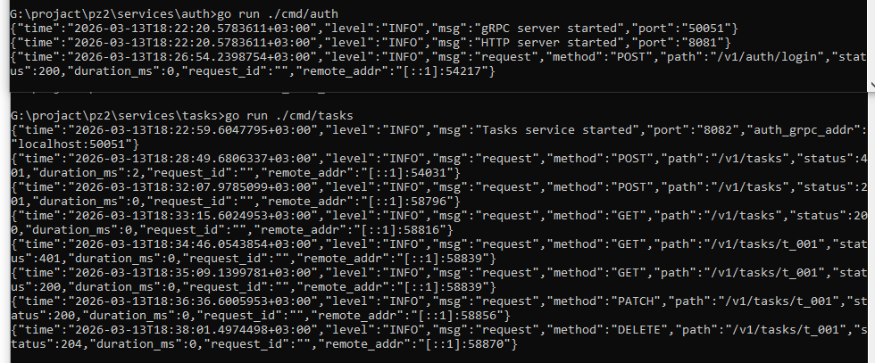

# Практика 2
## Выполнил: Студент ЭФМО-02-25 Фомичев Александр Сергеевич
### Структура:
```
services
    auth
        cmd
            auth
                main.go
        internal
            grpc
                server.go
            http
                handlers
                    login.go
                    verify.go
                routes.go
            service
                auth.go
    tasks
        cmd
            tasks
                main.go
        internal
            grpcclient
                client.go
            http
                handlers
                    tasks.go
                    middleware
                        auth.go
                routes.go
            service
                tasks.go
shared
    middleware
        requestid.go
        logging.go
    httpx
        client.go
pkg
    api
        auth
            v1
                auth.proto
                auth.pb.go
                auth_grpc.pb.go
docs
    pz17_api.md
README.md
go.mod
go.sum
```
### генерация кода
```
protoc --go_out=. --go_opt=paths=source_relative --go-grpc_out=. --go-grpc_opt=paths=source_relative pkg/api/auth/v1/auth.proto
```
### описание ошибок и маппинг на HTTP статусы
|gRPC статус (код)|	Описание|	HTTP статус|
|-----------------|---------|------------|
|OK (0)	|Токен валиден	|200/201/204 (успех операции)|
|Unauthenticated (16)	|Токен недействителен	|401 Unauthorized|
|DeadlineExceeded (4)	|Превышен таймаут вызова	|504 Gateway Timeout|
|Unavailable (14)	|Auth сервис недоступен	|503 Service Unavailable|
|Другие ошибки	|Внутренняя ошибка Auth	|500 Internal Server Error|

### пример логов (успех + Auth недоступен)
















